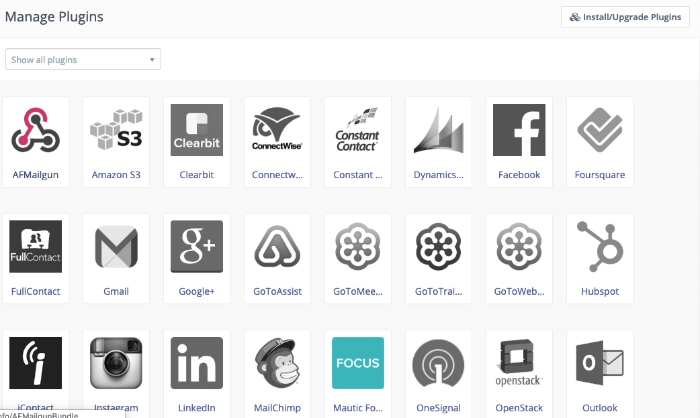
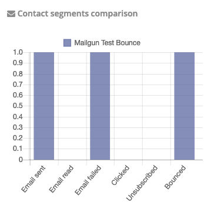

# Mailgun plugin for Mautic (AFMailgun)

## Installation

- upload the contents in this repo to mautic instalation `plugins/AFMailgunBundle`
- remove cache `sudo rm -rf app/cache/*`
- go to mautic settings > plugins > click `Install / Upgrade Plugin`
- done.

## Usage

- Choose Mailgun as the mail service, in mautic mail configuration > Email Settings.

Enter yours:
- host: smtp.mailgun.org (non EU) or smtp.eu.mailgun.org (EU)
- username e.g postmaster@mg.yourmailgundomain.com 
- the password (you can get these information on mailgun dashboard)

### Add webhook URL to mailgun

Add `https://yourmautic.com/mailer/mailgun/callback` in the mailgun webhook for your selected events:
- permanent failure
- spam complaints
- temporary failure
- unsubscribes

Now your mautic will be able to send through mailgun and track email events such as bounce, failed, unsubscribe, spam according to the webhook you set in mailgun.

### Screenshots

## Author

Muhammad Azamuddin

mas.azamuddin@gmail.com

https://arrowfunxtion.com
